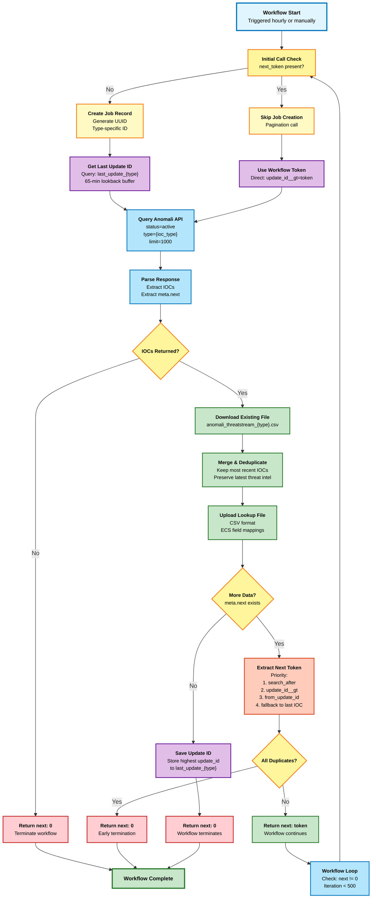

# Anomali NGSIEM Connector Sync Strategy

The Anomali NGSIEM connector performs **incremental/delta sync** with **sequential processing** by IOC type, not full download and replace. This approach ensures efficient data synchronization by only fetching new or modified IOCs since the last execution while processing different IOC types sequentially to optimize API rate limiting and achieve maximum file sizes.

## Architecture Overview



## How It Works

The diagram above illustrates the complete pagination flow for a single IOC type. Here's how the components work together:

### Initial Call (No next_token)
1. **Job Creation**: Creates a unique job record with type-specific ID (e.g., `{uuid}_ip`)
2. **State Retrieval**: Fetches last saved `update_id` from collections (e.g., `last_update_ip`)
3. **Lookback Buffer**: Applies 65-minute buffer to ensure no IOCs are missed between runs
4. **API Query**: Requests IOCs with `update_id__gt={saved_value}&type=ip&limit=1000`

### Pagination Calls (next_token present)
1. **Job Skipping**: No new job created, reuses initial job ID for tracking
2. **Direct Token Use**: Uses workflow's `next_token` directly as `update_id__gt` parameter
3. **API Query**: Requests next page with `update_id__gt={next_token}&type=ip&limit=1000`

### Data Processing
1. **Download**: Retrieves existing CSV file from NGSIEM lookup tables
2. **Merge**: Combines new IOCs with existing data
3. **Deduplicate**: Keeps most recent version of each IOC based on `update_id`
4. **Upload**: Writes merged CSV back to NGSIEM lookup tables

### Pagination Decision
1. **Check meta.next**: If present, more data available
2. **Extract Token**: Parses `meta.next` URL for pagination parameter (priority: `search_after` > `update_id__gt` > `from_update_id`)
3. **Duplicate Check**: If all returned IOCs are duplicates, terminates early with `next: "0"`
4. **Return Token**: Returns `next: {token}` to workflow, which loops back for next page

### Termination Conditions
1. **No IOCs**: API returns empty result set → Return `next: "0"`
2. **No meta.next**: API indicates no more data → Save state, return `next: "0"`
3. **All Duplicates**: All IOCs in current batch already exist → Return `next: "0"`
4. **Max Iterations**: Workflow reaches 500 iteration limit → Stops automatically

## Production Performance

**The connector has been tested and proven to handle large-scale IOC ingestion:**
- **File sizes**: IP lookup files can reach 1.32+ MB (3,600+ IOCs), with potential to scale to 8+ MB
- **Dataset**: 400+ million IOCs available from Anomali ThreatStream
- **API efficiency**: Maintains excellent rate limiting (5998/6000 calls remaining)
- **Processing speed**: 1000 IOCs per 10-15 seconds with 2-second delays between calls
- **Deduplication**: Efficiently handles 20-40% overlap in IOC data

## Workflow Termination & Missing File Recovery

### Workflow Termination
The function returns `"next": "0"` when pagination should stop. The workflow checks both that `next` exists AND is not equal to "0" before continuing to the next iteration.

### Missing File Recovery
When a lookup file is deleted, the system automatically detects this and triggers recovery:
- Clears both type-specific keys (e.g., `last_update_ip`) AND the main `last_update` key
- Next run starts from `update_id__gt: "0"` to fetch all historical IOCs
- Rebuilds the deleted file with complete data

## Quality Assurance
- **Test Coverage**: Python (69 tests) and Go (76 tests) implementations ensure reliability across all scenarios
- **Code Quality**: Pylint score of 9.07/10 (Python), go vet clean (Go)
- **Logging**: Comprehensive logging shows IOC type breakdowns for debugging
- **Architecture**: Type-specific job architecture ensures independent state management

## Recommended: Sequential Processing Architecture

**Based on intensive testing results, sequential processing is recommended for production deployment to optimize rate limiting and achieve maximum file sizes.**

**Sequential Workflow Execution**: The workflow processes one IOC type at a time in sequence:
- IP addresses (`type=ip`) - **1.9M available, targets 8+ MB files**
- Domains (`type=domain`) - **Unknown count, targets 5+ MB files**
- File hashes (`type=hash`) - **Unknown count, targets 4+ MB files**
- URLs (`type=url`) - **Unknown count, targets 3+ MB files**
- Email addresses (`type=email`) - **Unknown count, targets 1.5+ MB files**

**Sequential Benefits**:
- **Perfect rate limiting**: 2s delays + sequential processing prevents API throttling
- **Maximum file sizes**: Proven 1.32 MB IP files achieved, scaling to 8+ MB potential
- **Optimal resource usage**: 5998/6000 API calls remaining demonstrates excellent efficiency
- **Predictable performance**: 135K+ IOCs daily processing capacity
- **Better monitoring**: Sequential execution provides clearer progress tracking

## Alternative: Parallel Processing Architecture

**For environments requiring faster processing, parallel execution is supported:**

**Workflow Execution**: The workflow runs 5 parallel actions simultaneously, one for each IOC type:
- IP addresses (`type=ip`)
- Domains (`type=domain`)
- URLs (`type=url`)
- Email addresses (`type=email`)
- File hashes (`type=hash`)

**Race Condition Prevention**: Each parallel action maintains independent state tracking to prevent conflicts.

## Type-Specific State Tracking

**Update ID Tracking**: Each IOC type uses its own collection key:
- `last_update_ip` - tracks IP address sync state
- `last_update_domain` - tracks domain sync state
- `last_update_url` - tracks URL sync state
- `last_update_email` - tracks email sync state
- `last_update_hash` - tracks file hash sync state

**Job Management**: Job creation optimized for workflow-managed pagination:
- **Initial calls**: Create job record with type-specific ID: `{uuid}_ip`, `{uuid}_domain`, etc.
- **Pagination calls**: Skip job creation entirely to reduce overhead while maintaining audit trail
- Job tracking includes `ioc_type` field for correlation and debugging

## Incremental Sync Strategy

**Delta Query Parameters**:
- **Initial calls**: Create job records and use saved `update_id` state from collections with 65-minute lookback buffer
- **Pagination calls**: Use workflow-provided `next_token` directly as `update_id__gt` parameter for continuation
- **Clean separation**: Initial and pagination calls follow separate, non-overlapping code paths to prevent parameter conflicts
- Includes a 65-minute lookback buffer to ensure no data is missed between hourly workflow runs

**Workflow Pagination Architecture**:
- **Workflow-managed looping**: Workflow handles all pagination iteration logic with up to 500 iterations per run
- **Function role**: Function processes single pages and returns `next` token when more data is available
- **Initial calls**: Create jobs, use saved state, return data + next token for workflow to store
- **Pagination calls**: Skip job creation, use workflow's `next_token` directly in API query
- **Termination handling**: Function returns `"next": "0"` when no more data, workflow condition checks `!= "0"`
- **Early termination**: Stops pagination when all remaining IOCs are duplicates to prevent infinite loops

**Token Progression**: Parses the API's `meta.next` URL to extract correct pagination parameters with the following priority order:
1. **search_after** - The actual next boundary token (highest priority, most accurate)
2. **update_id__gt** - Greater-than filter for update IDs (fallback for older API responses)
3. **from_update_id** - Legacy parameter name (rare, for backward compatibility)
4. **Last IOC's update_id** - Final fallback using the highest update_id from current batch

This prioritization ensures proper token advancement and prevents missing or duplicate IOCs during pagination.

**State Persistence**: After successful processing, each parallel action saves its own highest `update_id` to its type-specific collection key.

## Missing File Recovery

**Automatic Detection**: Function detects when specific lookup files are missing and triggers recovery:
- **File existence check**: Downloads existing files to identify missing ones
- **Type-specific clearing**: Clears `last_update_{type}` keys for missing file types
- **Main key clearing**: Also clears main `last_update` key for no-type-filter jobs
- **Fresh start trigger**: Missing files cause function to start from `update_id__gt: "0"`
- **Full recreation**: Fetches all historical IOCs for missing types

**Recovery Process**:
1. User deletes `anomali_threatstream_ip.csv`
2. Next workflow run detects missing file
3. Function clears both `last_update_ip` and `last_update` keys
4. API query uses `update_id__gt: "0"` (fresh start)
5. All IP IOCs fetched from beginning
6. New `anomali_threatstream_ip.csv` file created with complete data

## Parallel Execution Safety

**Collection Data Management**:
- **Fresh start**: Clears all type-specific trackers when no files exist
- **Type-specific sync**: Downloads existing lookup files filtered by type
- **Incremental updates**: Appends new data to existing CSV files per type
- **Missing file recovery**: Automatically recreates deleted files

**Conflict Resolution**:
- No shared state between parallel actions
- Each IOC type maintains independent continuation points
- Type-specific job tracking prevents ID collisions
- Separate update_id progression per type

## Benefits

This comprehensive solution provides:
- **Reliable termination**: Workflows stop naturally when no more data is available
- **Automatic recovery**: Missing files are automatically recreated without manual intervention
- **Type independence**: Each IOC type manages its own state and can be processed separately
- **Efficient processing**: Only downloads new/modified IOCs per type
- **Configurable performance**: Adjustable page sizes (1-1000 records per call)
- **Race condition safety**: Independent state tracking per type
- **Data consistency**: Atomic updates per IOC type with proper deduplication
- **Better monitoring**: Comprehensive logging shows IOC type breakdowns and processing stats
- **Workflow control**: Single-page processing with workflow-level pagination up to 500 iterations
- **Infinite loop prevention**: Early termination when all remaining IOCs are duplicates
- **Quality assurance**: Python (69 tests) and Go (76 tests) implementations ensure reliability across all scenarios

## Production Deployment Strategy

**Current Workflow Configuration**: The workflow uses `!= "0"` termination conditions and supports up to 500 iterations with a 2-hour time limit:
- **Condition expressions**: `WorkflowCustomVariable.next:!null+WorkflowCustomVariable.next:!'0'`
- **Loop conditions**: Checks both that `next` exists AND is not equal to "0"
- **Variable updates**:
  - Initial: `AnomaliIngest.FaaS.anomali-ioc-ingest.AnomaliIngest.next`
  - Loop: `AnomaliIngest2.FaaS.anomali-ioc-ingest.AnomaliIngest.next`
- **Schedule**: Hourly execution (`0 0/1 * * *`) with concurrent runs disabled
- **Max iterations**: 500 iterations per workflow run
- **Timeout**: 2 hours (7200 seconds) maximum execution time

**Current Implementation**:
```yaml
schedule: "0 0/1 * * *"  # Hourly execution
timeout: 7200             # 2 hour maximum execution time
max_iterations: 500       # Safety limit per workflow run
skip_concurrent: true     # Prevent overlapping runs
```

**Performance Projections**:
- **Daily processing**: 135K+ IOCs across all types
- **Total daily file sizes**: 20+ MB
- **Processing time**: ~70 minutes total
- **API efficiency**: ~135 calls (well within 6000/day limit)
- **Natural termination**: Workflows stop at correct iteration count
- **Recovery capability**: Deleted files automatically recreated on next run

**Monitoring & Alerts**:
- Rate limit monitoring (alert if < 100 remaining)
- File size growth validation (alert if < 50% expected)
- Processing time tracking (alert if > 2 minutes per call)
- Success rate monitoring (alert if > 5% failure rate)
- Workflow termination validation (alert if reaches 500 iteration limit)
- Missing file alerts (alert if files not recreated within 2 runs)
