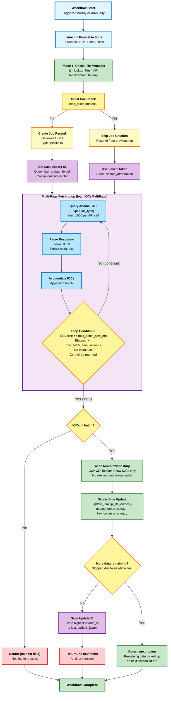

# Anomali NGSIEM Connector Sync Strategy

The Anomali NGSIEM connector performs **incremental/delta sync** with **parallel per-type processing**, not full download and replace. The workflow (`Anomali_Threat_Intelligence_Ingest.yml`, `provision_on_install: true`) processes all 5 IOC types concurrently as independent actions. Each function invocation internally pages through multiple Anomali API calls, accumulating IOCs until a configurable size or time limit is reached. It uses **server-side deduplication** in production — existing lookup files are never downloaded to `/tmp`; instead the function writes only new rows and uses the NGSIEM `update_lookup_file_entries()` API to merge and deduplicate server-side.

## Architecture Overview


```mermaid
flowchart TD
    Start["<b>Workflow Start</b><br/>Triggered hourly or manually"]

    Start --> Parallel["<b>Launch 5 Parallel Actions</b><br/>IP, Domain, URL, Email, Hash"]

    Parallel --> CheckMeta["<b>Phase 1: Check File Metadata</b><br/>list_lookup_files() API<br/>No download to /tmp"]

    CheckMeta --> InitCheck["<b>Initial Call Check</b><br/>next_token present?"]

    InitCheck -->|No| CreateJob["<b>Create Job Record</b><br/>Generate UUID<br/>Type-specific ID"]
    InitCheck -->|Yes| SkipJob["<b>Skip Job Creation</b><br/>Resume from previous run"]

    CreateJob --> GetState["<b>Get Last Update ID</b><br/>Query: last_update_{type}<br/>65-min lookback buffer"]
    SkipJob --> UseToken["<b>Use Saved Token</b><br/>Direct: search_after=token"]

    GetState --> MultiPage
    UseToken --> MultiPage

    subgraph MultiPage ["<b>Multi-Page Fetch Loop (fetchIOCsMultiPage)</b>"]
        direction TB
        Query["<b>Query Anomali API</b><br/>type={ioc_type}<br/>limit=1000 per API call"]
        Parse["<b>Parse Response</b><br/>Extract IOCs<br/>Extract meta.next"]
        Accumulate["<b>Accumulate IOCs</b><br/>Append to batch"]
        StopCheck{"<b>Stop Condition?</b><br/>CSV size >= max_batch_size_mb<br/>Elapsed >= max_fetch_time_seconds<br/>No meta.next<br/>Zero IOCs returned"}

        Query --> Parse
        Parse --> Accumulate
        Accumulate --> StopCheck
        StopCheck -->|"No (continue)"| Query
    end

    StopCheck -->|"Yes (stop)"| HasData{"<b>IOCs in batch?</b>"}

    HasData -->|No| Return0["<b>Return (no next field)</b><br/>Nothing to process"]

    HasData -->|Yes| WriteNew["<b>Write New Rows to /tmp</b><br/>CSV with header + new IOCs only<br/>No existing data downloaded"]

    WriteNew --> Upload["<b>Server-Side Update</b><br/>update_lookup_file_entries()<br/>update_mode=update, key_columns=primary"]

    Upload --> CheckRemaining{"<b>More data remaining?</b><br/>Stopped due to size/time limit"}

    CheckRemaining -->|Yes| ReturnNext["<b>Return next: token</b><br/>Remaining data picked up<br/>on next scheduled run"]

    CheckRemaining -->|No| SaveState["<b>Save Update ID</b><br/>Store highest update_id<br/>to last_update_{type}"]

    SaveState --> Return0Final["<b>Return (no next field)</b><br/>All data ingested"]

    Return0 --> End["<b>Workflow Complete</b>"]
    Return0Final --> End
    ReturnNext --> End

    style Start fill:#e1f5ff,stroke:#0277bd,stroke-width:3px,color:#000,font-size:14px
    style Parallel fill:#e1f5ff,stroke:#0277bd,stroke-width:2px,color:#000,font-size:13px
    style End fill:#c8e6c9,stroke:#2e7d32,stroke-width:3px,color:#000,font-size:14px
    style CreateJob fill:#fff9c4,stroke:#f57f17,stroke-width:2px,color:#000,font-size:13px
    style SkipJob fill:#fff9c4,stroke:#f57f17,stroke-width:2px,color:#000,font-size:13px
    style GetState fill:#e1bee7,stroke:#6a1b9a,stroke-width:2px,color:#000,font-size:13px
    style UseToken fill:#e1bee7,stroke:#6a1b9a,stroke-width:2px,color:#000,font-size:13px
    style Query fill:#b3e5fc,stroke:#0277bd,stroke-width:2px,color:#000,font-size:13px
    style Parse fill:#b3e5fc,stroke:#0277bd,stroke-width:2px,color:#000,font-size:13px
    style Accumulate fill:#b3e5fc,stroke:#0277bd,stroke-width:2px,color:#000,font-size:13px
    style CheckMeta fill:#c8e6c9,stroke:#2e7d32,stroke-width:2px,color:#000,font-size:13px
    style WriteNew fill:#c8e6c9,stroke:#2e7d32,stroke-width:2px,color:#000,font-size:13px
    style Upload fill:#c8e6c9,stroke:#2e7d32,stroke-width:2px,color:#000,font-size:13px
    style SaveState fill:#e1bee7,stroke:#6a1b9a,stroke-width:2px,color:#000,font-size:13px
    style HasData fill:#fff59d,stroke:#f57f17,stroke-width:2px,color:#000,font-size:13px
    style StopCheck fill:#fff59d,stroke:#f57f17,stroke-width:2px,color:#000,font-size:13px
    style CheckRemaining fill:#fff59d,stroke:#f57f17,stroke-width:2px,color:#000,font-size:13px
    style Return0 fill:#ffcdd2,stroke:#c62828,stroke-width:2px,color:#000,font-size:13px
    style Return0Final fill:#ffcdd2,stroke:#c62828,stroke-width:2px,color:#000,font-size:13px
    style ReturnNext fill:#c8e6c9,stroke:#2e7d32,stroke-width:2px,color:#000,font-size:13px
    style InitCheck fill:#fff59d,stroke:#f57f17,stroke-width:2px,color:#000,font-size:13px
    style MultiPage fill:#f3e5f5,stroke:#6a1b9a,stroke-width:2px,color:#000,font-size:13px
```

## How It Works

The diagram above illustrates the complete flow for a single IOC type. Each function invocation internally pages through multiple Anomali API calls via `fetchIOCsMultiPage` / `fetch_iocs_multi_page`, accumulating IOCs into a batch before uploading. Here's how the components work together:

### Phase 1: File Existence Check (Always First)
1. **Metadata Check**: Calls `ngsiem.list_lookup_files(filter=...)` to determine which lookup files already exist — no file content is downloaded
2. **Missing File Recovery**: If a previously-tracked file is missing, clears its `update_id` to trigger a fresh start for that type
3. **Fresh Start Detection**: If no files exist at all, clears all collection data

### Initial Call (No next_token)
1. **Job Creation**: Creates a unique job record with type-specific ID (e.g., `{uuid}_ip`)
2. **State Retrieval**: Fetches last saved `update_id` from collections (e.g., `last_update_ip`)
3. **Lookback Buffer**: Applies 65-minute buffer to ensure no IOCs are missed between runs
4. **Multi-Page Fetch**: Calls `fetchIOCsMultiPage` / `fetch_iocs_multi_page` which loops over Anomali API pages (each limited to 1000 IOCs per API call), accumulating IOCs until a stop condition is met

### Continuation Calls (next_token present from a previous run)
1. **Job Skipping**: No new job created, reuses initial job ID for tracking
2. **Direct Token Use**: Uses the saved `next_token` directly as the starting `search_after` parameter
3. **Multi-Page Fetch**: Resumes multi-page accumulation from where the previous run left off

### Data Processing (Server-Side Deduplication)

In **production mode**, the function never downloads existing lookup files to `/tmp`. Instead:
1. **Metadata Check**: Calls `ngsiem.list_lookup_files(filter=...)` to check if the file exists in the resources list — no file content is downloaded
2. **Write New Rows Only**: Creates a CSV in `/tmp` containing only the new IOC rows (with header). No existing data is downloaded or merged locally.
3. **Server-Side Update**: Calls `update_lookup_file_entries(update_mode="update", key_columns=<primary_field>)` which handles deduplication server-side — matching rows are replaced, new rows are appended.
4. **Cleanup**: `gc.collect()` is called after processing to release memory

For **new files** (no existing file in NGSIEM), uses `update_lookup_file_entries(update_mode="append")` to create and populate the file.

In **test mode** (`TEST_MODE=true`), files are written to a local `test_output/` directory instead of being uploaded to NGSIEM.

### Pagination Decision
1. **Internal Loop**: The multi-page fetch loop checks `meta.next` after each API call to determine if more pages are available
2. **Extract Token**: Parses `meta.next` URL for pagination parameter (priority: `search_after` > `update_id__gt` > `from_update_id`)
3. **Stop or Continue**: If a stop condition is reached mid-ingestion, the function returns a `next` token so remaining data is picked up on the next scheduled run (hourly)

### Termination Conditions
The multi-page fetch loop inside the function stops when any of these conditions is met:
1. **Size limit reached**: Estimated CSV size >= `max_batch_size_mb` (default 100 MB, max 150 MB)
2. **Time limit reached**: Elapsed time >= `max_fetch_time_seconds` (default 300 seconds, max 600 seconds)
3. **No more data**: API response has no `meta.next` token
4. **Zero IOCs returned**: API returns an empty result set

## Production Performance

**The connector has been tested and proven to handle large-scale IOC ingestion:**
- **File sizes**: IP lookup files can reach 1.32+ MB (3,600+ IOCs), with potential to scale to 200+ MB
- **Dataset**: 400+ million IOCs available from Anomali ThreatStream
- **API efficiency**: Maintains excellent rate limiting (5998/6000 calls remaining)
- **Processing speed**: 1000 IOCs per 10-15 seconds with 2-second delays between calls
- **Deduplication**: Server-side dedup via `update_lookup_file_entries()` handles overlap efficiently

## Server-Side Deduplication Architecture (Large File Optimization)

The server-side deduplication architecture eliminates the need to download or stream existing lookup files entirely. This is critical for Foundry functions which have limited disk and memory, especially as lookup files grow to 200MB+.

### Key Components

**`check_existing_file_metadata(repository, ioc_type, logger)`**:
- Calls `ngsiem.list_lookup_files(filter=...)` for each known lookup file via `_call_with_retry`
- Checks if the filename appears in the response's `resources` list
- Returns `Set[str]` of filenames that exist in NGSIEM
- HTTP 404 / missing from resources indicates the file doesn't exist (not an error)
- Retries transient errors (429/500/503)

**`upload_entries_to_ngsiem(csv_files, repository, existing_files, logger)`**:
- Reads the new-rows-only CSV from `/tmp`
- For existing files: calls `ngsiem.update_lookup_file_entries(update_mode="update", key_columns=<primary>, ignore_case="false")`
- For new files: calls `ngsiem.update_lookup_file_entries(update_mode="append")`
- Server handles matching on key column and replacing existing rows with updated versions
- Retries transient errors (429/500/503)

**`upload_csv_files_to_ngsiem(csv_files, repository, logger, existing_files)`**:
- Router function that selects the upload strategy:
  - Test mode → writes files to local `test_output/` directory via `upload_csv_files_locally()`
  - Production with existing files → `upload_entries_to_ngsiem()` (server-side dedup)
  - Production without existing files → `upload_csv_files_to_ngsiem_actual()` (full file upload)

### Upload Strategy Selection

The `upload_csv_files_to_ngsiem()` router selects the upload path based on environment and file existence:

| Mode | Condition | Upload strategy |
|------|-----------|----------------|
| Test (`TEST_MODE=true`) | Any | `upload_csv_files_locally()` — writes to `test_output/` directory |
| Production | `existing_files` is non-empty (`Set[str]`) | `upload_entries_to_ngsiem()` — server-side dedup |
| Production | `existing_files` is empty | `upload_csv_files_to_ngsiem_actual()` — full file upload |

### Memory Profile

- **Before** (download-then-merge): 2x file size in `/tmp` (downloaded + merged output)
- **After** (server-side dedup): Only new rows in `/tmp` (~small batch) + lightweight list API call for existence checks
- `gc.collect()` called after processing to release memory promptly

## Workflow Termination & Missing File Recovery

### Workflow Termination
The function omits the `"next"` field from the response body when all available data has been ingested. If the function hits its size or time limit mid-ingestion, it returns a `next` token so remaining data is picked up on the next scheduled run.

### Missing File Recovery
When a lookup file is deleted, the system detects this via the `list_lookup_files()` check and triggers recovery:
- Only recovers files that were **previously tracked** (have a `last_update_{type}` entry in collections)
- IOC types that never appeared in the feed are not considered "missing"
- Clears type-specific keys (e.g., `last_update_ip`) for missing file types
- Next run omits the cursor entirely (fresh start) to fetch all historical IOCs
- Rebuilds the deleted file with complete data

## Query Filtering

The function supports multiple filtering parameters for both initial and pagination calls:

**Type Filters**:
- `type`: Single IOC type (`ip`, `domain`, `url`, `email`, `hash`, `md5`, `sha1`, `sha256`)
- Hash subtypes (`md5`, `sha1`, `sha256`) are mapped to `hash` for the Anomali API but produce separate lookup files
- `itype`: Anomali indicator subtype for granular filtering (e.g., `bot_ip`, `mal_domain`, `apt_email`)

**Feed Filters**:
- `trustedcircles`: Comma-separated feed IDs (e.g., `"11631,12345"`)
- `feed_id`: Alternative parameter for feed ID filtering

**Confidence Filters**:
- `confidence_gt`, `confidence_gte`, `confidence_lt`, `confidence_lte`: Numeric confidence score bounds

**Severity Filter**:
- `severity`: Filter by Anomali machine-learning assigned severity (`meta.severity`). Values: `low`, `medium`, `high`, `very-high`

**Status Filter**:
- `status`: IOC status filter (no default — retrieves all statuses unless specified)

**TLP Filter**:
- `tlp`: Traffic Light Protocol designation. Values: `red`, `amber`, `amber+strict`, `green`, `clear`

**Value Filters**:
- `value_contains`: Filter by observable value containing specified text (maps to Anomali `value__contains`)
- `value_startswith`: Filter by observable value starting with specified text (maps to Anomali `value__startswith`)

**Tag Filter**:
- `tags_name`: Filter by tag name (maps to Anomali `tags.name`)

**Search Filters**:
- `search_filter`: ID of a saved search filter to execute
- `q`: Advanced search query using Anomali filter language

## Parallel Processing Architecture

**The workflow (`Anomali_Threat_Intelligence_Ingest.yml`)** processes all 5 IOC types concurrently as independent single actions triggered in parallel from the schedule.

**Workflow Execution**: The workflow launches 5 parallel actions simultaneously — one per IOC type:
- IP addresses (`type=ip`)
- Domains (`type=domain`)
- URLs (`type=url`)
- Email addresses (`type=email`)
- File hashes (`type=hash`)

**Internal Multi-Page Pagination**: Each function invocation handles its own pagination internally via `fetchIOCsMultiPage` / `fetch_iocs_multi_page`. The function loops over multiple Anomali API pages (each limited to 1000 IOCs), accumulating IOCs until a size limit, time limit, or end-of-data condition is reached. There are no workflow-level loops, variables, or `CreateVariable`/`UpdateVariable` actions.

**Benefits**:
- **Faster processing**: All 5 types process simultaneously
- **Minimal /tmp usage**: Only new rows written to disk per type (no existing file download)
- **Independent pagination**: Each type paginates independently within its own function invocation, preventing one slow type from blocking others
- **Independent failure isolation**: A failure in one type does not affect the others
- **Simplified workflow**: No loop constructs, variables, or condition expressions — each type is a single action

**Race Condition Prevention**: Each parallel action maintains independent state tracking to prevent conflicts.

## Type-Specific State Tracking

**Update ID Tracking**: Each IOC type uses its own collection key:
- `last_update_ip` - tracks IP address sync state
- `last_update_domain` - tracks domain sync state
- `last_update_url` - tracks URL sync state
- `last_update_email` - tracks email sync state
- `last_update_hash` - tracks file hash sync state

**Job Management**: Job creation optimized for workflow-managed pagination:
- **Initial calls**: Create job record with type-specific ID: `{uuid}_ip`, `{uuid}_domain`, etc.
- **Pagination calls**: Skip job creation entirely to reduce overhead while maintaining audit trail
- Job tracking includes `ioc_type` field for correlation and debugging

## Incremental Sync Strategy

**Delta Query Parameters**:
- **Initial calls**: Create job records and use saved `update_id` state from collections with 65-minute lookback buffer
- **Pagination calls**: Use saved `next_token` directly as `search_after` parameter for continuation
- **Clean separation**: Initial and pagination calls follow separate, non-overlapping code paths to prevent parameter conflicts
- Includes a 65-minute lookback buffer to ensure no data is missed between hourly workflow runs

**Internal Multi-Page Pagination Architecture**:
- **Function-managed looping**: The function handles all pagination internally via `fetchIOCsMultiPage` / `fetch_iocs_multi_page`, looping over multiple Anomali API pages per invocation
- **Accumulation**: Each API call returns up to 1000 IOCs; the function accumulates IOCs across pages until a stop condition is met
- **Stop conditions**: Estimated CSV size >= `max_batch_size_mb`, elapsed time >= `max_fetch_time_seconds`, no `meta.next` token, or zero IOCs returned
- **Initial calls**: Create jobs, use saved state, fetch multiple pages, return data + optional `next` token if interrupted by size/time limit
- **Continuation calls**: Skip job creation, resume multi-page fetch from saved `next_token`
- **Remaining data**: If the function hits its size or time limit mid-ingestion, it returns a `next` token; remaining data is picked up on the next scheduled run (hourly), not via workflow loop
- **Cursor advancement**: Even when no supported IOC types produce CSV files, the cursor is advanced to avoid re-fetching the same page

**Token Progression**: Parses the API's `meta.next` URL to extract the pagination cursor with the following priority order:
1. **search_after** - Anomali's native pagination cursor (highest priority, works on all accounts)
2. **update_id__gt** - Legacy parameter (fallback for older API responses; some accounts reject it)
3. **from_update_id** - Legacy parameter name (rare, for backward compatibility)
4. **Last IOC's update_id** - Final fallback using the highest update_id from current batch

This prioritization ensures proper token advancement and prevents missing or duplicate IOCs during pagination.

**State Persistence**: After successful processing, each parallel action saves its own highest `update_id` to its type-specific collection key.

## Missing File Recovery

**Automatic Detection**: Function detects when specific lookup files are missing via `list_lookup_files()` API and triggers recovery:
- **File existence check**: Calls `ngsiem.list_lookup_files(filter=...)` and checks if the file appears in the response's resources list
- **Previously tracked only**: Only considers a file "missing" if it has a `last_update_{type}` entry in collections — types that never appeared in the feed are ignored.
- **Type-specific clearing**: Clears `last_update_{type}` keys for missing file types
- **Fresh start trigger**: Missing files cause function to omit the cursor entirely (fresh start)
- **Full recreation**: Fetches all historical IOCs for missing types

**Recovery Process**:
1. User deletes `anomali_threatstream_ip.csv`
2. Next workflow run detects missing file (not in `list_lookup_files()` response + tracker entry exists)
3. Function clears `last_update_ip` key
4. API query omits the cursor (fresh start, returns from beginning)
5. All IP IOCs fetched from beginning
6. New `anomali_threatstream_ip.csv` file created with complete data

## Parallel Execution Safety

**Collection Data Management**:
- **Fresh start**: Clears all type-specific trackers when no files exist
- **Type-specific sync**: Checks for existing lookup files via `list_lookup_files()` filtered by type (no download)
- **Incremental updates**: Server-side dedup merges new data with existing CSV files per type
- **Missing file recovery**: Automatically recreates deleted files

**Conflict Resolution**:
- No shared state between parallel actions
- Each IOC type maintains independent continuation points
- Type-specific job tracking prevents ID collisions
- Separate update_id progression per type

## Rate Limiting & Retry

**Anomali API Rate Limiting**:
- Detects HTTP 429 responses (direct) and 207 Multi-Status with embedded 429 errors
- Respects `Retry-After` header when present
- Falls back to exponential backoff with jitter: `5 * 2^attempt + random(0, 2)` seconds
- Maximum 5 retries before failing

**NGSIEM Centralized Retry **:
All NGSIEM API calls (metadata checks, uploads, collection writes) share a single retry helper:
- Retryable status codes: HTTP 429, 500, and 503
- Exponential backoff: 5s, 10s, 20s, 40s, 60s (capped at `max_backoff=60`)
- Maximum 5 attempts by default

## Benefits

This comprehensive solution provides:
- **Reliable termination**: Workflows stop naturally when no more data is available
- **Automatic recovery**: Missing files are automatically recreated without manual intervention
- **Type independence**: Each IOC type manages its own state and can be processed separately
- **Efficient processing**: Only new/modified IOCs sent to NGSIEM per type
- **Minimal disk usage**: Only new rows written to `/tmp` — no existing file download
- **Memory efficiency**: No streaming buffers or full file downloads needed
- **Server-side dedup**: NGSIEM handles merge/replace logic via `update_lookup_file_entries()`
- **Configurable performance**: Adjustable multi-page fetch parameters (`max_batch_size_mb` up to 150 MB, `max_fetch_time_seconds` up to 600 seconds)
- **Race condition safety**: Independent state tracking per type
- **Data consistency**: Atomic updates per IOC type with server-side key-based deduplication
- **Better monitoring**: Comprehensive logging shows IOC type breakdowns and processing stats
- **Workflow control**: Internal multi-page pagination with size and time limits per function invocation
- **Flexible filtering**: Confidence, severity, TLP, itype, value, tag, feed, trusted circles, saved search, and advanced query filters
- **Quality assurance**: Python and Go test suites ensure reliability across all scenarios

## Production Deployment Strategy

**Current Workflow Configuration**: The workflow (`Anomali_Threat_Intelligence_Ingest.yml`, `provision_on_install: true`) launches 5 parallel actions (one per IOC type) with no loops, variables, or iteration constructs:
- **No workflow loops**: The `loops:` section, `CreateVariable`, and all `UpdateVariable*` actions have been removed
- **Function-level pagination**: Each function invocation handles multi-page fetching internally via `fetchIOCsMultiPage` / `fetch_iocs_multi_page`
- **Size/time limits**: `max_batch_size_mb` (default 100, max 150) and `max_fetch_time_seconds` (default 300, max 600) control how much data is processed per invocation
- **Cross-run continuation**: If the function hits its size/time limit, it returns a `next` token; remaining data is picked up on the next scheduled run
- **Schedule**: Hourly execution (`0 0/1 * * *`) with concurrent runs disabled
- **Timeout**: 2 hours (7200 seconds) maximum execution time

**Current Implementation**:
```yaml
name: Anomali Threat Intelligence Ingest
provision_on_install: true
schedule: "0 0/1 * * *"    # Hourly execution
skip_concurrent: true       # Prevent overlapping runs
branches: 5 parallel actions (IP, Domain, URL, Email, Hash)
# No variables, no loops — each action is a single function invocation
# that handles multi-page pagination internally
```

**Performance Projections**:
- **Daily processing**: 135K+ IOCs across all types
- **Total daily file sizes**: 20+ MB
- **Processing time**: ~70 minutes total
- **API efficiency**: ~135 calls (well within 6000/day limit)
- **Natural termination**: Workflows stop at correct iteration count
- **Recovery capability**: Deleted files automatically recreated on next run

**Monitoring & Alerts**:
- Rate limit monitoring (alert if < 100 remaining)
- File size growth validation (alert if < 50% expected)
- Processing time tracking (alert if > 2 minutes per call)
- Success rate monitoring (alert if > 5% failure rate)
- Workflow termination validation (alert if approaching 2-hour workflow timeout)
- Missing file alerts (alert if files not recreated within 2 runs)