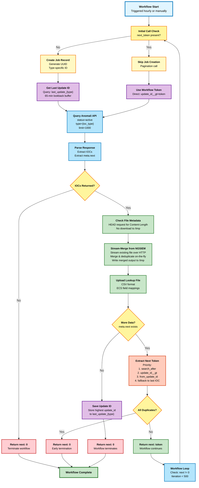

# Anomali NGSIEM Connector Sync Strategy

The Anomali NGSIEM connector performs **incremental/delta sync** with **parallel per-type processing**, not full download and replace. Two workflow options are available: a **parallel workflow** (default, `provision_on_install: true`) that processes all 5 IOC types concurrently, and a **sequential workflow** that processes types one at a time. Both use **stream-merge architecture** in production — existing lookup files are never downloaded to `/tmp`; instead they are streamed directly from NGSIEM and merged with new data on-the-fly to minimize memory and disk usage for large files.

## Architecture Overview


```mermaid
flowchart TD
    Start["<b>Workflow Start</b><br/>Triggered hourly or manually"]

    Start --> InitCheck["<b>Initial Call Check</b><br/>next_token present?"]

    InitCheck -->|No| CreateJob["<b>Create Job Record</b><br/>Generate UUID<br/>Type-specific ID"]
    InitCheck -->|Yes| SkipJob["<b>Skip Job Creation</b><br/>Pagination call"]

    CreateJob --> GetState["<b>Get Last Update ID</b><br/>Query: last_update_{type}<br/>65-min lookback buffer"]
    SkipJob --> UseToken["<b>Use Workflow Token</b><br/>Direct: update_id__gt=token"]

    GetState --> Query["<b>Query Anomali API</b><br/>status=active<br/>type={ioc_type}<br/>limit=1000"]
    UseToken --> Query

    Query --> Parse["<b>Parse Response</b><br/>Extract IOCs<br/>Extract meta.next"]

    Parse --> HasData{"<b>IOCs Returned?</b>"}

    HasData -->|No| Return0["<b>Return next: 0</b><br/>Terminate workflow"]

    HasData -->|Yes| CheckMeta["<b>Check File Metadata</b><br/>HEAD request for Content-Length<br/>No download to /tmp"]

    CheckMeta --> StreamMerge["<b>Stream-Merge from NGSIEM</b><br/>Stream existing file over HTTP<br/>Merge & deduplicate on-the-fly<br/>Write merged output to /tmp"]

    StreamMerge --> Upload["<b>Upload Lookup File</b><br/>CSV format<br/>ECS field mappings"]

    Upload --> CheckNext{"<b>More Data?</b><br/>meta.next exists"}

    CheckNext -->|Yes| ExtractToken["<b>Extract Next Token</b><br/>Priority:<br/>1. search_after<br/>2. update_id__gt<br/>3. from_update_id<br/>4. fallback to last IOC"]

    CheckNext -->|No| SaveState["<b>Save Update ID</b><br/>Store highest update_id<br/>to last_update_{type}"]

    ExtractToken --> CheckDupes{"<b>All Duplicates?</b>"}

    CheckDupes -->|Yes| Return0Dupes["<b>Return next: 0</b><br/>Early termination"]
    CheckDupes -->|No| ReturnNext["<b>Return next: token</b><br/>Workflow continues"]

    SaveState --> Return0Final["<b>Return next: 0</b><br/>Workflow terminates"]

    ReturnNext --> WorkflowLoop["<b>Workflow Loop</b><br/>Check: next != 0<br/>Iteration < 500"]

    WorkflowLoop --> InitCheck

    Return0 --> End["<b>Workflow Complete</b>"]
    Return0Dupes --> End
    Return0Final --> End

    style Start fill:#e1f5ff,stroke:#0277bd,stroke-width:3px,color:#000,font-size:14px
    style End fill:#c8e6c9,stroke:#2e7d32,stroke-width:3px,color:#000,font-size:14px
    style CreateJob fill:#fff9c4,stroke:#f57f17,stroke-width:2px,color:#000,font-size:13px
    style SkipJob fill:#fff9c4,stroke:#f57f17,stroke-width:2px,color:#000,font-size:13px
    style GetState fill:#e1bee7,stroke:#6a1b9a,stroke-width:2px,color:#000,font-size:13px
    style UseToken fill:#e1bee7,stroke:#6a1b9a,stroke-width:2px,color:#000,font-size:13px
    style Query fill:#b3e5fc,stroke:#0277bd,stroke-width:2px,color:#000,font-size:13px
    style Parse fill:#b3e5fc,stroke:#0277bd,stroke-width:2px,color:#000,font-size:13px
    style CheckMeta fill:#c8e6c9,stroke:#2e7d32,stroke-width:2px,color:#000,font-size:13px
    style StreamMerge fill:#c8e6c9,stroke:#2e7d32,stroke-width:2px,color:#000,font-size:13px
    style Upload fill:#c8e6c9,stroke:#2e7d32,stroke-width:2px,color:#000,font-size:13px
    style ExtractToken fill:#ffccbc,stroke:#d84315,stroke-width:2px,color:#000,font-size:13px
    style SaveState fill:#e1bee7,stroke:#6a1b9a,stroke-width:2px,color:#000,font-size:13px
    style HasData fill:#fff59d,stroke:#f57f17,stroke-width:2px,color:#000,font-size:13px
    style CheckNext fill:#fff59d,stroke:#f57f17,stroke-width:2px,color:#000,font-size:13px
    style CheckDupes fill:#fff59d,stroke:#f57f17,stroke-width:2px,color:#000,font-size:13px
    style Return0 fill:#ffcdd2,stroke:#c62828,stroke-width:2px,color:#000,font-size:13px
    style Return0Dupes fill:#ffcdd2,stroke:#c62828,stroke-width:2px,color:#000,font-size:13px
    style Return0Final fill:#ffcdd2,stroke:#c62828,stroke-width:2px,color:#000,font-size:13px
    style ReturnNext fill:#c8e6c9,stroke:#2e7d32,stroke-width:2px,color:#000,font-size:13px
    style WorkflowLoop fill:#b3e5fc,stroke:#0277bd,stroke-width:2px,color:#000,font-size:13px
    style InitCheck fill:#fff59d,stroke:#f57f17,stroke-width:2px,color:#000,font-size:13px
```

## How It Works

The diagram above illustrates the complete pagination flow for a single IOC type. Here's how the components work together:

### Initial Call (No next_token)
1. **Job Creation**: Creates a unique job record with type-specific ID (e.g., `{uuid}_ip`)
2. **State Retrieval**: Fetches last saved `update_id` from collections (e.g., `last_update_ip`)
3. **Lookback Buffer**: Applies 65-minute buffer to ensure no IOCs are missed between runs
4. **API Query**: Requests IOCs with `update_id__gt={saved_value}&type=ip&limit=1000`

### Pagination Calls (next_token present)
1. **Job Skipping**: No new job created, reuses initial job ID for tracking
2. **Direct Token Use**: Uses workflow's `next_token` directly as `update_id__gt` parameter
3. **API Query**: Requests next page with `update_id__gt={next_token}&type=ip&limit=1000`

### Data Processing (Stream-Merge Architecture)

In **production mode**, the function never downloads existing lookup files to `/tmp`. Instead:
1. **Metadata Check**: Issues a streaming GET to NGSIEM, extracts `Content-Length` header, and closes the connection immediately — no body downloaded
2. **Stream-Merge**: Re-opens a streaming connection and reads the existing CSV row-by-row via `ResponseStreamAdapter` (a `io.RawIOBase` subclass that wraps `response.iter_content()`)
3. **Deduplicate**: As each existing row is streamed, it is checked against the new IOC set; duplicates are replaced by the newer version
4. **Write**: Merged output is written to a single `/tmp` file (only the final merged result touches disk)
5. **Upload**: Writes merged CSV back to NGSIEM lookup tables
6. **Cleanup**: `gc.collect()` is called after processing to release memory

In **test mode** (`TEST_MODE=true`), the original disk-based download-then-merge behavior is preserved for local development.

### Pagination Decision
1. **Check meta.next**: If present, more data available
2. **Extract Token**: Parses `meta.next` URL for pagination parameter (priority: `search_after` > `update_id__gt` > `from_update_id`)
3. **Duplicate Check**: If all returned IOCs are duplicates, terminates early with `next: "0"`
4. **Return Token**: Returns `next: {token}` to workflow, which loops back for next page

### Termination Conditions
1. **No IOCs**: API returns empty result set → Return `next: "0"`
2. **No meta.next**: API indicates no more data → Save state, return `next: "0"`
3. **All Duplicates**: All IOCs in current batch already exist → Return `next: "0"`
4. **Max Iterations**: Workflow reaches 500 iteration limit → Stops automatically

## Production Performance

**The connector has been tested and proven to handle large-scale IOC ingestion:**
- **File sizes**: IP lookup files can reach 1.32+ MB (3,600+ IOCs), with potential to scale to 8+ MB
- **Dataset**: 400+ million IOCs available from Anomali ThreatStream
- **API efficiency**: Maintains excellent rate limiting (5998/6000 calls remaining)
- **Processing speed**: 1000 IOCs per 10-15 seconds with 2-second delays between calls
- **Deduplication**: Efficiently handles 20-40% overlap in IOC data

## Stream-Merge Architecture (Large File Optimization)

The stream-merge architecture eliminates the need to download large existing lookup files to `/tmp` before merging. This is critical for Foundry functions which have limited disk and memory.

### Key Components

**`check_existing_file_metadata(repository, ioc_type, logger)`**:
- Issues a streaming GET to NGSIEM for each known lookup file
- Extracts `Content-Length` from response headers
- Closes the connection immediately without reading the body
- Returns `Dict[str, int]` mapping filename → Content-Length (or -1 if chunked transfer encoding)
- HTTP 404 responses indicate the file doesn't exist (not an error)

**`ResponseStreamAdapter(response, chunk_size=65536)`**:
- `io.RawIOBase` subclass that wraps `response.iter_content()`
- Provides a file-like binary stream interface for `csv.reader`
- Tracks `bytes_consumed` to verify stream completeness against `Content-Length`
- Uses 64KB chunks for balanced memory/performance

**`stream_merge_from_ngsiem(repository, filename, output_path, columns, new_rows, expected_size, logger)`**:
- Opens a streaming connection to NGSIEM for the existing file
- Wraps response in `ResponseStreamAdapter` → `BufferedReader` → `TextIOWrapper` → `csv.reader`
- Reads existing rows one-by-one, filtering out duplicates that will be replaced by new data
- Writes surviving existing rows + all new rows to `output_path` in batches of 10,000
- Verifies `bytes_consumed == expected_size` to detect truncated streams
- On truncation or error: deletes partial output, retries up to 5 times with exponential backoff

### Dual-Mode Processing

The `existing_files` dictionary uses `Union[str, int]` values to support both modes:

| Mode | `existing_files` value | Merge strategy |
|------|----------------------|----------------|
| Production (`TEST_MODE=false`) | `int` (Content-Length from metadata check) | `stream_merge_from_ngsiem()` — streams over HTTP |
| Test (`TEST_MODE=true`) | `str` (file path on disk) | Disk-based merge — reads from `/tmp` |

### Memory Profile

- **Before** (download-then-merge): 2x file size in `/tmp` (downloaded + merged output)
- **After** (stream-merge): 1x file size in `/tmp` (merged output only) + ~64KB streaming buffer
- `gc.collect()` called after processing to release memory promptly

## Workflow Termination & Missing File Recovery

### Workflow Termination
The function returns `"next": "0"` when pagination should stop. The workflow checks both that `next` exists AND is not equal to "0" before continuing to the next iteration.

### Missing File Recovery
When a lookup file is deleted, the system automatically detects this and triggers recovery:
- Clears both type-specific keys (e.g., `last_update_ip`) AND the main `last_update` key
- Next run starts from `update_id__gt: "0"` to fetch all historical IOCs
- Rebuilds the deleted file with complete data

## Quality Assurance
- **Test Coverage**: Python (69 tests) and Go (76 tests) implementations ensure reliability across all scenarios
- **Code Quality**: Pylint score of 9.07/10 (Python), go vet clean (Go)
- **Logging**: Comprehensive logging shows IOC type breakdowns for debugging
- **Architecture**: Type-specific job architecture ensures independent state management

## Recommended: Parallel Processing Architecture (Default)

**The parallel workflow (`Anomali_Threat_Intelligence_Ingest_Parallel.yml`) is the default production deployment** (`provision_on_install: true`). It processes all 5 IOC types concurrently with independent pagination loops, optimizing `/tmp` usage via stream-merge.

**Workflow Execution**: The workflow creates per-type variables and launches 5 parallel branches simultaneously:
- IP addresses (`type=ip`) → variable `next_ip`
- Domains (`type=domain`) → variable `next_domain`
- URLs (`type=url`) → variable `next_url`
- Email addresses (`type=email`) → variable `next_email`
- File hashes (`type=hash`) → variable `next_hash`

**Per-Type Pagination Loops**: Each branch has its own loop with independent termination:
- **Condition**: `WorkflowCustomVariable.next_{type}:!null+WorkflowCustomVariable.next_{type}:!'0'`
- **Variable update**: `${data['Ingest{Type}.FaaS.anomali-ioc-ingest.AnomaliIngest.next']}`
- **Loop variable**: `${data['WorkflowCustomVariable.next_{type}']}`

**Parallel Benefits**:
- **Faster processing**: All 5 types process simultaneously instead of sequentially
- **Optimized /tmp usage**: Stream-merge means only one merged output file per type touches disk
- **Independent pagination**: Each type paginating independently prevents one slow type from blocking others
- **Independent failure isolation**: A failure in one type does not affect the others

**Race Condition Prevention**: Each parallel action maintains independent state tracking to prevent conflicts.

## Type-Specific State Tracking

**Update ID Tracking**: Each IOC type uses its own collection key:
- `last_update_ip` - tracks IP address sync state
- `last_update_domain` - tracks domain sync state
- `last_update_url` - tracks URL sync state
- `last_update_email` - tracks email sync state
- `last_update_hash` - tracks file hash sync state

## Alternative: Sequential Processing Architecture

**The sequential workflow (`Anomali_Threat_Intelligence_Ingest.yml`) is available for environments where rate limiting is a concern** (`provision_on_install: false`).

**Sequential Workflow Execution**: A single action processes all IOC types internally without a `type` parameter. The function handles type iteration internally.

**Sequential Benefits**:
- **Perfect rate limiting**: 2s delays + sequential processing prevents API throttling
- **Predictable performance**: Clearer progress tracking with single execution path
- **Simpler workflow**: Single `next` variable and single pagination loop

## Workflow Comparison

| Aspect | Sequential | Parallel (Default) |
|--------|-----------|-------------------|
| File | `Anomali_Threat_Intelligence_Ingest.yml` | `Anomali_Threat_Intelligence_Ingest_Parallel.yml` |
| `provision_on_install` | `false` | `true` |
| Type handling | No `type` param — function handles internally | Explicit `type=ip/domain/url/email/hash` per action |
| Pagination vars | Single `next` | Per-type: `next_ip`, `next_domain`, `next_url`, `next_email`, `next_hash` |
| Parallelism | None — single action per iteration | 5 branches execute concurrently |
| Variable update path | `AnomaliIngest.FaaS.anomali-ioc-ingest.AnomaliIngest.next` | `Ingest{Type}.FaaS.anomali-ioc-ingest.AnomaliIngest.next` |
| Loop condition | `WorkflowCustomVariable.next:!null+...next:!'0'` | `WorkflowCustomVariable.next_{type}:!null+...next_{type}:!'0'` |
| `/tmp` optimization | Stream-merge (same as parallel) | Stream-merge — only merged output on disk |

**Job Management**: Job creation optimized for workflow-managed pagination:
- **Initial calls**: Create job record with type-specific ID: `{uuid}_ip`, `{uuid}_domain`, etc.
- **Pagination calls**: Skip job creation entirely to reduce overhead while maintaining audit trail
- Job tracking includes `ioc_type` field for correlation and debugging

## Incremental Sync Strategy

**Delta Query Parameters**:
- **Initial calls**: Create job records and use saved `update_id` state from collections with 65-minute lookback buffer
- **Pagination calls**: Use workflow-provided `next_token` directly as `update_id__gt` parameter for continuation
- **Clean separation**: Initial and pagination calls follow separate, non-overlapping code paths to prevent parameter conflicts
- Includes a 65-minute lookback buffer to ensure no data is missed between hourly workflow runs

**Workflow Pagination Architecture**:
- **Workflow-managed looping**: Workflow handles all pagination iteration logic with up to 500 iterations per run
- **Function role**: Function processes single pages and returns `next` token when more data is available
- **Initial calls**: Create jobs, use saved state, return data + next token for workflow to store
- **Pagination calls**: Skip job creation, use workflow's `next_token` directly in API query
- **Termination handling**: Function returns `"next": "0"` when no more data, workflow condition checks `!= "0"`
- **Early termination**: Stops pagination when all remaining IOCs are duplicates to prevent infinite loops

**Token Progression**: Parses the API's `meta.next` URL to extract correct pagination parameters with the following priority order:
1. **search_after** - The actual next boundary token (highest priority, most accurate)
2. **update_id__gt** - Greater-than filter for update IDs (fallback for older API responses)
3. **from_update_id** - Legacy parameter name (rare, for backward compatibility)
4. **Last IOC's update_id** - Final fallback using the highest update_id from current batch

This prioritization ensures proper token advancement and prevents missing or duplicate IOCs during pagination.

**State Persistence**: After successful processing, each parallel action saves its own highest `update_id` to its type-specific collection key.

## Missing File Recovery

**Automatic Detection**: Function detects when specific lookup files are missing via metadata checks and triggers recovery:
- **File existence check**: In production, issues a streaming GET and checks for HTTP 404 (no download required). In test mode, checks for file presence on disk.
- **Type-specific clearing**: Clears `last_update_{type}` keys for missing file types
- **Main key clearing**: Also clears main `last_update` key for no-type-filter jobs
- **Fresh start trigger**: Missing files cause function to start from `update_id__gt: "0"`
- **Full recreation**: Fetches all historical IOCs for missing types

**Recovery Process**:
1. User deletes `anomali_threatstream_ip.csv`
2. Next workflow run detects missing file
3. Function clears both `last_update_ip` and `last_update` keys
4. API query uses `update_id__gt: "0"` (fresh start)
5. All IP IOCs fetched from beginning
6. New `anomali_threatstream_ip.csv` file created with complete data

## Parallel Execution Safety

**Collection Data Management**:
- **Fresh start**: Clears all type-specific trackers when no files exist
- **Type-specific sync**: Checks metadata for existing lookup files filtered by type (no download)
- **Incremental updates**: Stream-merges new data with existing CSV files per type
- **Missing file recovery**: Automatically recreates deleted files

**Conflict Resolution**:
- No shared state between parallel actions
- Each IOC type maintains independent continuation points
- Type-specific job tracking prevents ID collisions
- Separate update_id progression per type

## Benefits

This comprehensive solution provides:
- **Reliable termination**: Workflows stop naturally when no more data is available
- **Automatic recovery**: Missing files are automatically recreated without manual intervention
- **Type independence**: Each IOC type manages its own state and can be processed separately
- **Efficient processing**: Only downloads new/modified IOCs per type
- **Minimal disk usage**: Stream-merge architecture avoids downloading existing files to `/tmp`
- **Memory efficiency**: `ResponseStreamAdapter` streams data without buffering entire files in memory
- **Configurable performance**: Adjustable page sizes (1-1000 records per call)
- **Race condition safety**: Independent state tracking per type
- **Data consistency**: Atomic updates per IOC type with proper deduplication
- **Better monitoring**: Comprehensive logging shows IOC type breakdowns and processing stats
- **Workflow control**: Single-page processing with workflow-level pagination up to 500 iterations
- **Infinite loop prevention**: Early termination when all remaining IOCs are duplicates
- **Quality assurance**: Python (69 tests) and Go (76 tests) implementations ensure reliability across all scenarios

## Production Deployment Strategy

**Current Workflow Configuration**: The parallel workflow is the default (`provision_on_install: true`). It uses per-type `!= "0"` termination conditions with independent pagination loops:
- **Condition expressions**: `WorkflowCustomVariable.next_{type}:!null+WorkflowCustomVariable.next_{type}:!'0'`
- **Loop conditions**: Each type checks that its own `next_{type}` exists AND is not equal to "0"
- **Variable updates** (per branch):
  - Initial: `Ingest{Type}.FaaS.anomali-ioc-ingest.AnomaliIngest.next`
  - Loop: `Ingest{Type}2.FaaS.anomali-ioc-ingest.AnomaliIngest.next`
- **Schedule**: Hourly execution (`0 0/1 * * *`) with concurrent runs disabled
- **Timeout**: 2 hours (7200 seconds) maximum execution time

**Current Implementation**:
```yaml
# Parallel workflow (default)
name: Anomali Threat Intelligence Ingest Parallel
provision_on_install: true
schedule: "0 0/1 * * *"    # Hourly execution
skip_concurrent: true       # Prevent overlapping runs
variables: next_ip, next_domain, next_url, next_email, next_hash
branches: 5 parallel (IP, Domain, URL, Email, Hash)
loops: per-type with sequential: true
```

**Performance Projections**:
- **Daily processing**: 135K+ IOCs across all types
- **Total daily file sizes**: 20+ MB
- **Processing time**: ~70 minutes total
- **API efficiency**: ~135 calls (well within 6000/day limit)
- **Natural termination**: Workflows stop at correct iteration count
- **Recovery capability**: Deleted files automatically recreated on next run

**Monitoring & Alerts**:
- Rate limit monitoring (alert if < 100 remaining)
- File size growth validation (alert if < 50% expected)
- Processing time tracking (alert if > 2 minutes per call)
- Success rate monitoring (alert if > 5% failure rate)
- Workflow termination validation (alert if reaches 500 iteration limit)
- Missing file alerts (alert if files not recreated within 2 runs)
